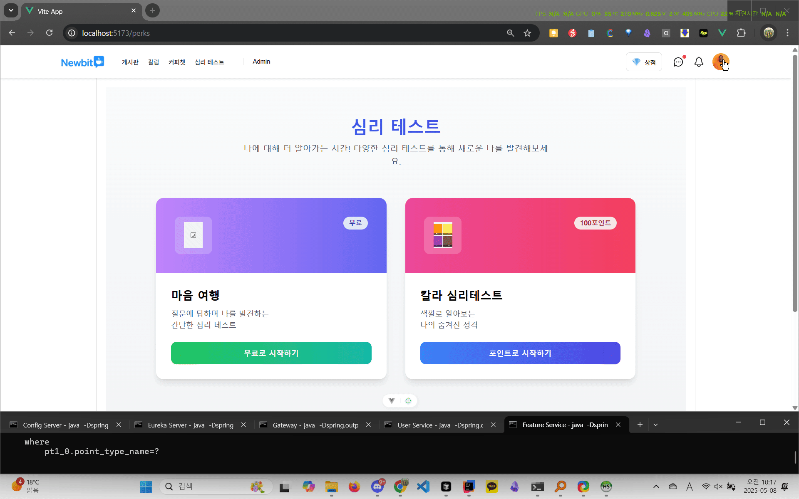
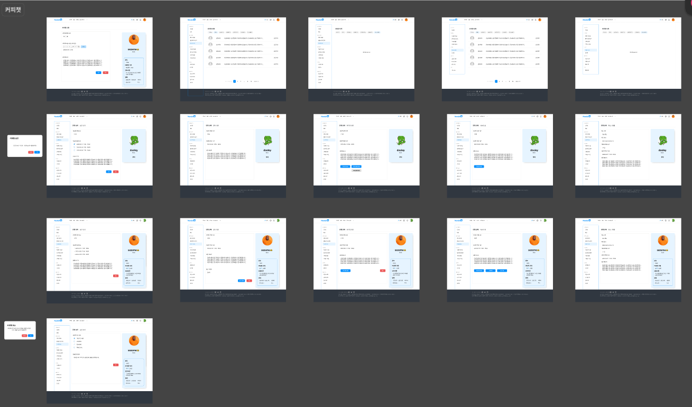

# NewBit - 개발자 멘토링 플랫폼

<div align="center">
  
</div>

<br>

# 📋 목차

<a href="#0">🎙️ 프로젝트 소개</a>

<a href="#1">👨‍👩‍👧‍👦 팀원 소개</a>

<a href="#2">🛠 기술 스택</a>

<a href="#3">📡 문서 링크 </a>

<a href="#4">👀 ERD</a>

<a href="#5">📍 아키텍쳐</a>

<a href="#6">📌 주요 기능</a>

<a href="#7">🫡 프로젝트 구조</a>

<a href="#8">🎨 화면 ui</a>

<a href="#9">📃 회고록</a>

<a href="#10">📜 라이센스</a>

<br><br>

---

# <p id="0"> 📝 프로젝트 소개

Newbit은 사회 초년생과 지식과 다양한 경험을 가진 IT 전문가들이 자유롭게 소통하고 함께 성장할 수 있도록 돕는 지식 멘토링 커뮤니티 플랫폼입니다. 멘토는 자신의 인사이트를 칼럼과 커피챗(1:1 상담) 형식으로 공유하고, 멘티(일반 사용자)가 이를 구매하거나 구독하여 성장에 필요한 정보를 얻을 수 있습니다.

> 실무에 막 발을 디딘 신입 개발자에게는 실제 경험이 담긴 조언이 가장 필요합니다.  
> 하지만 그런 정보는 검색으로 쉽게 찾을 수 없습니다.  
> **Newbit**은 실무 경험이 담긴 콘텐츠를 연결하고, 더 나아가 사람을 연결합니다.

### 🎯 이런 문제들을 해결하고자 합니다

🙋‍♀️ 멘티에게는

- 칼럼/시리즈와 1:1 커피챗을 통해 믿을 수 있는 멘토의 실무 지식을 제공받을 수 있습니다.

- 입사 초기에 어려움을 겪는 문서 작성, 양식 문제를 쉽게 해결할 수 있도록 도와줍니다.

- 다양한 IT 관련 주제를 자유롭게 이야기할 수 있는 커뮤니티를 제공합니다.

👨‍🏫 멘토에게는

- 본인의 커리어 경험을 정리해 콘텐츠로 만들고 수익화할 수 있는 기회를 제공합니다.
- 커피챗을 통해 멘티와 깊이 있는 교류를 나눌 수 있습니다.

**이 레포지토리는 한화 BEYOND 부트캠프 15기 'LetsGetIt' 팀의 학습과 협업을 위한 프로젝트 파일을 담고 있습니다.<br>
모든 문서와 코드에 서술된 내용은 학습 목적으로 설정된 가상의 데이터와 환경을 기반으로 작성되었습니다.**

# <p id="1"> 👨‍👩‍👧‍👦 팀원 소개

| 이름   | 역할                    |                    GitHub                     |
| ------ | ----------------------- | :-------------------------------------------: |
| 김경민 | 백엔드, 프론트엔드 개발 | [gyeongmin03](https://github.com/gyeongmin03) |
| 김기홍 | 백엔드, 프론트엔드 개발 |    [Kihong12](https://github.com/Kihong12)    |
| 김진영 | 백엔드, 프론트엔드 개발 |   [kimjy8937](https://github.com/kimjy8937)   |
| 김채원 | 백엔드, 프론트엔드 개발 |      [sezeme](https://github.com/sezeme)      |
| 박양하 | 백엔드, 프론트엔드 개발 |     [64etuor](https://github.com/64etuor)     |
| 오유경 | 백엔드, 프론트엔드 개발 |     [oyk0510](https://github.com/oyk0510)     |

# <p id="2"> 🛠 기술 스택

<div align="center">
  
### Backend & Database
  


### Frontend


### Communication Protocols


### Tools & Communication


</div>

# <p id="3"> 🔗 문서 링크

## 프레젠테이션

- [BE Powerpoint 문서](https://docs.google.com/presentation/d/11G4_GNc5dlZcgKw5RPP-vGZSRRCIeN7t/edit#slide=id.p1)
- [FE Powerpoint 문서](https://docs.google.com/presentation/d/1NCJaUrWr4Os9JrGR8ZjdEubyR3cYRAUP/edit?usp=sharing&ouid=101829531113308310114&rtpof=true&sd=true)

## API 문서

- [Swagger API 문서](https://64etuor.github.io/700_studies/2501-2507-한화beyond-sw캠프/1_프로젝트/2차-백엔드/api-docs/dist/)
  <div align="center">
    
  </div>

## 설계 문서

- [DDD 설계 문서](https://miro.com/app/board/uXjVINvVwgo=/?share_link_id=532750127721)
- [요구사항 명세서](https://docs.google.com/spreadsheets/d/1aflf9F-G79LgBtK9sxy4J_ZFPHslv-X5P6s3-67kGR4/edit?gid=721187272#gid=721187272)
- [기능 명세서](https://docs.google.com/spreadsheets/d/1aflf9F-G79LgBtK9sxy4J_ZFPHslv-X5P6s3-67kGR4/edit?gid=55030434#gid=55030434)
  <div align="center">
    
  </div>

## 테스트 결과 보고서

### BE 테스트 결과 보고서

- [테스트 결과 보고서](https://docs.google.com/document/d/1eEU6sED_ITLF-2X6D3e6yWcYB-gYg7WDk_agsvssvpw/edit?tab=t.0)
- [Test Coverage Report](https://64etuor.github.io/700_studies/2501-2507-%ED%95%9C%ED%99%94beyond-sw%EC%BA%A0%ED%94%84/1_%ED%94%84%EB%A1%9C%EC%A0%9D%ED%8A%B8/2%EC%B0%A8-%EB%B0%B1%EC%97%94%EB%93%9C/test_report/jacocoHtml/)
- [JUnit Test Report](https://64etuor.github.io/700_studies/2501-2507-%ED%95%9C%ED%99%94beyond-sw%EC%BA%A0%ED%94%84/1_%ED%94%84%EB%A1%9C%EC%A0%9D%ED%8A%B8/2%EC%B0%A8-%EB%B0%B1%EC%97%94%EB%93%9C/test_report/reports/tests/test/)

### FE 테스트 결과 보고서

#### 유저

<details>
  <summary>회원가입 -> 아이디찾기 -> 비밀번호 찾기 -> 로그인 -> 로그아웃</summary>
  <div align="center">
    
  </div>

</details>
<details>
  <summary>유저 프로필 조회</summary>
  <div align="center">
    
  </div>
</details>

<details>
  <summary>멘토 프로필 조회</summary>
  <div align="center">
    
  </div>
</details>

#### 칼럼

<details>
  <summary>칼럼 조회, 등록 요청</summary>
  <div align="center">
    
  </div>
</details>

<details>
  <summary>칼럼 수정 요청(멘토)</summary>
  <div align="center">
    
  </div>
</details>

<details>
  <summary>칼럼 요청 관리(승인, 반려)</summary>
  <div align="center">
    
  </div>
</details>

<details>
  <summary>칼럼 구매</summary>
  <div align="center">
    
  </div>
</details>

<details>
  <summary>칼럼/시리즈 목록 조회 및 시리즈 발행</summary>
  <div align="center">
    
  </div>
</details>

#### 게시글

<details>
  <summary>게시글 작성 → 게시글 수정 → 게시글 삭제</summary>
  <div align="center">
    
  </div>
</details>
<details>
  <summary>게시글 목록조회 → 게시글 상세조회 → 댓글 조회 → 댓글 작성 → 댓글 삭제</summary>
  <div align="center">
    
  </div>
</details>
<details>
  <summary>게시글 신고 → 댓글 신고</summary>
  <div align="center">
    
  </div>
</details>
<details>
  <summary>공지사항 등록, 수정, 삭제</summary>
  <div align="center">
    
  </div>
</details>
<details>
  <summary>게시글 검색</summary>
  <div align="center">
    
  </div>
</details>

#### 커피챗

<details>
  <summary>멘토 목록 조회 → 커피챗 신청 → 내가 신청한 커피챗 목록 조회</summary>
  <div align="center">
    
  </div>
</details>
<details>
  <summary>멘토가 커피챗 승인</summary>
  <div align="center">
    
  </div>
</details>

<details>
  <summary>멘티가 다이아 결제</summary>
  <div align="center">
    
  </div>
</details>

<details>
  <summary>멘토가 커피챗 종료</summary>
  <div align="center">
    
  </div>
</details>

<details>
  <summary>커피챗 구매 확정 → 리뷰 작성 → 멘토 프로필 페이지에서 해당 리뷰 조회</summary>
  <div align="center">
    
  </div>
</details>

#### 마이페이지

<details>
  <summary>프로필 수정</summary>
  <div align="center">
    
  </div>
</details>
<details>
  <summary>멘토 프로필 수정</summary>
  <div align="center">
    
  </div>
</details>

#### 커피레터

<details>
  <summary>채팅방</summary>
  <div align="center">
    
  </div>
</details>

#### 결제

<details>
  <summary>결제진행</summary>
  <div align="center">
    
  </div>
</details>
<details>
  <summary>결제취소</summary>
  <div align="center">
    
  </div>
</details>

#### 심리테스트

<details>
  <summary>유료심리테스트</summary>
  <div align="center">
    
  </div>
</details>
<details>
  <summary>무료테스트</summary>
  <div align="center">
    
  </div>
</details>
<details>
  <summary>포인트구매실패</summary>
  <div align="center">
    
  </div>
</details>

#### 신고

<details>
  <summary>신고 조회</summary>
  <div align="center">
    
  </div>
</details>

<br>

# <p id="4"> 💾 ERD

프로젝트 데이터베이스 설계는 아래 링크에서 확인할 수 있습니다:

- [ERD Cloud - NewBit 데이터베이스 설계](https://www.erdcloud.com/d/u5XEXGDGqbanZgQNK)
  <div align="center">
    
  </div>

# <p id="5"> 🏗 아키텍처

- MSA 아키텍처 구조도
  <div align="center">
    
  </div>

# <p id="6"> 📋 주요 기능

### 회원 관리

- 회원가입 및 로그인
- 회원 정보 관리

### 멘토링 시스템

- 멘토 프로필 및 검색
- 커피챗 예약 및 관리
- 멘토 등급 및 리뷰 시스템

### 콘텐츠 관리

- 칼럼 작성 및 조회
- 시리즈 관리
- 유료 콘텐츠 결제

### 결제 시스템

- 다이아몬드(가상화폐) 충전
- 콘텐츠 및 멘토링 서비스 결제
- 결제 내역 관리

### 커뮤니티

- 게시판 운영
- 댓글 시스템
- 알림 서비스

# <p id="7"> 📁 프로젝트 구조

Back-End

```
📦 newbit-gateway/
└── src/
└── main/
└── java/com/newbit/newbitgateway/
├── dto/ # API 응답 DTO
├── error/ # JWT 에러 코드
├── exception/ # 공통 예외 핸들러
├── filter/ # 요청 필터
└── jwt/ # JWT 토큰 발급/검증

🧑‍💻 newbit-user-service/
└── src/
└── main/
└── java/com/newbit/newbituserservice/
├── auth/ # 인증 기능
├── client/ # 외부 통신 (Feign 등)
├── common/
│ ├── config/ # Feign, Swagger, JPA 설정
│ ├── dto/ # 공통 DTO
│ └── exception/ # 예외 처리
├── security/
│ ├── config/
│ ├── filter/
│ └── model/ # JWT 토큰, 핸들러 등
└── user/
├── controller/
├── dto/
├── entity/
├── mapper/
├── repository/
├── service/
└── support/

🧩 newbit-feature-service/
└── src/
└── main/
└── java/com/newbit/newbitfeatureservice/
├── client/ # Feign 통신
├── coffeechat/ # 커피챗
├── coffeeletter/ # 커피챗 후기/메시지
├── column/ # 칼럼 도메인
├── like/ # 좋아요
├── notification/ # 알림
├── payment/ # 결제
├── post/ # 게시판
├── product/ # 상품 정보
├── purchase/ # 결제 내역
├── report/ # 신고
├── s3/ # S3 파일 업로드
├── security/ # 보안 설정
├── settlement/ # 정산 기능
└── subscription/ # 시리즈 구독
```

Front-End

```
src/
├── api/ # 기능별 API 모듈 (column.js, user.js 등)
├── components/ # 공용 UI 컴포넌트
├── config/ # Toast UI, 알림 등 설정 파일
├── router/ # Vue Router 설정
├── stores/ # Pinia 상태 관리
├── views/ # 글로벌 뷰 (AdminPage 등)
├── App.vue # 루트 컴포넌트
│
└── features/ #
├── admin/ # 관리자 페이지 (승인/반려)
├── column/ # 칼럼 등록/수정/요청/조회
├── series/ # 시리즈 생성/수정/삭제
├── coffeechat/ # 커피챗 신청 및 관리
├── coffeeletter/ # 커피챗 후속 메시지/피드백
├── mypage/ # 마이페이지 (내 정보, 구매내역)
├── payment/ # 결제 및 다이아몬드 충전
├── notification/ # 알림 기능
├── post/ # 자유 게시판
├── product/ # 상품 정보
├── perk/ # 멘토 혜택/등급 시스템
├── profile/ # 프로필 보기/수정
├── report/ # 신고 기능
└── user/ # 로그인/회원가입, 유저 관리
```

# <p id="8"> 화면 ui

<details>
  <summary>회원/로그인</summary>

#### 회원 정보 수정

  

#### 로그인/아이디찾기/비밀번호찾기/회원가입

  

</details>
<details>
  <summary>마이페이지</summary>

#### 내 콘텐츠

  

#### 활동내역

  

#### 유저프로필/멘토프로필

  

</details>
<details>
  <summary>칼럼/게시글</summary>

#### 칼럼

  

#### 게시판

  

</details>
<details>
  <summary>커피챗/리뷰</summary>

#### 커피챗

  

#### 리뷰

  
  
  #### 커피레터
  

</details>
<details>
  <summary>상품</summary>

#### 상품

  

#### 심리테스트

  

</details>

<details>
  <summary>신고/관리자</summary>

#### 신고/관리자

  

</details>

# <p id="9"> 회고록

|  이름  | COMMENT                                                                                                                                                                                                                                                                                                                                                                                                                                                                                                                                                                                                                                                                                                                                                                                                                                                                                                                                                                                                                                                                                                                                                                                                                                                                                                                                                                                                                                                                                                                                                                                                                                                                                                                                                                                                                                                                                                                                                                                                                                                                                                                                             |
| :----: | :-------------------------------------------------------------------------------------------------------------------------------------------------------------------------------------------------------------------------------------------------------------------------------------------------------------------------------------------------------------------------------------------------------------------------------------------------------------------------------------------------------------------------------------------------------------------------------------------------------------------------------------------------------------------------------------------------------------------------------------------------------------------------------------------------------------------------------------------------------------------------------------------------------------------------------------------------------------------------------------------------------------------------------------------------------------------------------------------------------------------------------------------------------------------------------------------------------------------------------------------------------------------------------------------------------------------------------------------------------------------------------------------------------------------------------------------------------------------------------------------------------------------------------------------------------------------------------------------------------------------------------------------------------------------------------------------------------------------------------------------------------------------------------------------------------------------------------------------------------------------------------------------------------------------------------------------------------------------------------------------------------------------------------------------------------------------------------------------------------------------------------------------------- |
| 김경민 | 이번 프로젝트는 단순한 웹 애플리케이션 개발을 넘어, Spring 기반의 MSA 구조, JWT 인증, 그리고 Vue.js 프론트엔드까지 전체 시스템을 아우르는 작업이었다. 나는 유저 도메인의 백엔드 구현을 했고, 프론트엔드 역시 유저 관련 기능을 맡아 회원가입, 로그인, 로그아웃 등 회원의 기본적인 로직을 구현했다. 가장 어려웠던 부분은 단연 Spring Security였다. 처음에는 단순히 JWT 기반 인증만 구현하면 되겠지라고 생각했지만, 실제로는 그 이상이었다. Spring Security는 Filter 기반 구조로 동작하며, 인증(Authentication)과 인가(Authorization)를 분리해 처리한다. 이 구조를 완전히 이해하는 데 꽤 오랜 시간이 걸렸고, SecurityContextHolder, OncePerRequestFilter, PreAuthenticatedAuthenticationToken과 같은 낯선 개념들과도 마주해야 했다. 단순히 토큰을 검사하는 수준이 아니라, Spring이 요청을 어떻게 흐르게 하는지를 파악해야만 제대로 된 인증 흐름을 구성할 수 있었다. 아직도 완벽하게 이해하지는 못했지만, 이번 경험을 통해 어떻게 다뤄야 할지 감은 확실히 잡게 되었다. 이번 프로젝트는 나에게 단순한 기능 구현 이상의 의미가 있다. 실제 서비스가 어떻게 작동하는지, 어떻게 각 기능을 나누고 연결해야 하는지, 그리고 협업과 설계가 얼마나 중요한지를 처음으로 제대로 체감했다. 기능이 완벽하지는 않았지만, 그 과정에서 이전보다 훨씬 더 나은 개발자가 되었다고 느낀다. 그리고 무엇보다 부족한 부분을 채워주고 함께 고민해준 팀원들에게 엄청 고마움을 느끼고 있다. 앞으로 더 나은 개발자가 되기 위해서 더 많은 노력을 해야겠다.                                                                                                                                                                                                                                                                                                                                                                                                                                                                                                                                                                                                                                                                                                                           |
| 오유경 | 이번 프로젝트는 MSA 구조로 서버를 나누고, 백엔드와 프론트를 모두 직접 구현해본 의미있는 경험이었습니다. User, Feature, Gateway로 나누어 구성하여 서비스 간 통신을 위해 Feign Client와 JWT 인증을 적용하면서 실제 분산 시스템의 구조를 체험할 수 있었습니다. 이번에 가장 어려웠던 부분은 백엔드 로직이 프론트와 연동되었을 때 발생하는 예외처리였습니다. DTO에 값이 없어 리스트가 안 뜨는 경우, null 필드 때문에 랜더링이 깨지는 경우가 반복이 되었고, 이를 해결하기 위해 백엔드 응답 구조를 다듬고, 프론트에서는 fallback 처리를 신경 썼습니다. 특히, 백엔드 작업을 먼저 진행했기 때문에, 프론트 개발 단계에 와서야 추가적으로 필요한 필드들이 눈에 들어오게 되었고, 그 과정에서 백엔드 설계는 결국 프론트 사용성과 함께 가야 한다는 걸 몸소 깨달았습니다. 또한 이번 프로젝트에서 PM 역할을 맡으면서, 생각보다 더 체계적인 계획 수립이 중요하다는 걸 느꼈습니다. 막연히 눈앞의 일정만 정하는 것이 아니라, 기능 단위로 단기, 중기, 장기 목표를 세분화해서 관리해야 했고, 그에 따라 팀원 역할 분배, 우선순위 조정, 일정 조율까지 챙기는 게 PM의 핵심이라는 걸 직접 겪으며 배웠습니다. 단순히 진행 상황을 확인하는 역할이 아니라, 전체 방향을 설계하고, 팀의 전반적인 중심을 잡아주는 사람이 PM이라는 걸 이번 경험을 통해 실감하게 되었습니다. 이 과정을 거치며 단순 기능 구현을 넘어, 실제 사용자 관점에서 백엔드를 설계하고, 서비스 전체의 흐름을 파악하는 경험까지 해볼 수 있었던 프로젝트였습니다. 전체적으로 프론트와 백엔드를 오가며 직접 문제를 해결하고, 구조를 고민하고, 설계까지 챙겨본 경험이라 정말 많이 성장할 수 있었던 것 같습니다.                                                                                                                                                                                                                                                                                                                                                                                                                                                                                                                                                                                                     |
| 김채원 | 이번 프로젝트는 spring boot부터 시작해서 vue.js까지 아우를 수 있는 프로젝트였다. 우리 팀은 msa구조를 적용시켜 진행했다. 오류가 조금 더 자주 났지만 그만큼 msa 구조에 익숙해지는 시간이 되었다. 개인적으로는 프론트엔드 개발이 가장 어려웠다. 꼼꼼하지 못해 경로를 틀리거나 request/response 객체를 제대로 다루지 못해 시간이 많이 걸렸. 나중에는 체크리스트를 만들어서 오류가 났을 때 경로나 객체 흐름을 빠르게 확인하는 방식으로 작업하니 실수도 줄고 속도도 낼 수 있었다. 도메인 측면에서는 커피챗 기능을 맡았고 유저의 행동에 따라 상태가 바뀌는 구조를 명확히 정의하지 않아 초반에 어려움을 겪었다. 시간이 조금 걸리더라도 처음부터 논리적으로 정리된 기획의 중요성을 다시 한 번 깨달았다. 내가 맡은 커피챗 도메인 개발 과정에서 백엔드에서 신경 썼던 부분은 ui에서 어떻게 구현될지 미리 생각해본 것이었고 프론트 구현까지 고려하여 최대한 이미 구현해둔 백엔드를 건드리지 않도록 한 부분이었고 프론트 작업 중에 큰 수정 없이 안정적으로 유지되었다. 프론트엔드에 대한 이해가 부족하다고 느낀다. 어렴풋하게 어떤 기능인지만 알고 사용하는 함수나 컴포넌트가 많았는데, 이번 프로젝트 끝나고 복기하면서 지식을 계속 불려나가고싶다. 팀원분들과 협업하면서 사회에서 신뢰를 쌓고 원만한 관계를 유지하는 방법을 배울 수 있었던 의미있는 프로젝트였다.                                                                                                                                                                                                                                                                                                                                                                                                                                                                                                                                                                                                                                                                                                                                                                                                                                                                                                |
| 박양하 | 인간의 선택 메커니즘은 신경과학과 행동경제학 관점에서 분석할 때 흥미로운 패턴을 보인다. 뇌의 기저핵과 전전두엽 피질의 상호작용은 습관적 행동 패턴을 형성하는데, 이는 일상적 선택에서 '최소 에너지 원칙'을 따르는 경향으로 나타난다. 즉, 인지적 부하를 최소화하는 방향으로 의사결정이 이루어진다. 베이지안 추론 모델에 따르면, 개인의 과거 행동 패턴은 사전 확률(prior probability)로 작용하여 이후 선택의 확률 분포를 조건화한다. 이는 마치 자기강화 학습 알고리즘과 유사하게, 한번 형성된 행동 패턴이 지속적으로 강화되는 피드백 루프를 생성한다. 따라서 통계적으로 '게으른' 행동 패턴을 보인 개인은 미래에도 동일한 패턴을 반복할 확률이 높아진다. 자유의지에 대한 환상은 인지심리학에서 '통제력 착각(illusion of control)'으로 설명된다. 다니엘 웨그너(Daniel Wegner)의 연구에 따르면, 의식적 의도와 행동 사이의 일시적 연관성이 인과관계로 오인되는 경향이 있다. 실제로 fMRI 연구들은 의사결정이 의식적 인식보다 최대 7초 전에 신경학적으로 이미 결정될 수 있음을 시사한다. 자유 의지로 믿는 나의 선택이 실상 만성적 습관에 의존에 의한 것일 수도 있음을 의미한다.자기합리화 메커니즘은 인지부조화 이론으로 설명 가능하다. 인간은 자신의 행동과 믿음 사이의 불일치를 경험할 때 심리적 불편함을 해소하기 위해 외부 요인에 책임을 전가하는 방식으로 대응한다. 이는 자기보존적 귀인 오류(self-serving attribution bias)의 한 형태로, 실패는 외부 요인에, 성공은 내부 요인에 귀인하는 체계적 편향이다.결국 자기인식과 메타인지는 이러한 결정론적 패턴에서 벗어날 수 있는 가능성을 제시한다. 신경가소성(neuroplasticity)의 원리에 따르면, 자기인식을 통한 의도적 개입은 뇌의 신경회로를 재구성할 수 있다. 따라서 자신의 행동 패턴에 대한 객관적 관찰과 자기비판적 사고는 기존의 결정론적 경로에서 벗어나 진정한 의미의 선택적 자유를 향한 첫걸음이 될 수 있다.결론적으로, 인간의 선택은 완전한 자유와 완전한 결정론 사이의 스펙트럼 상에 존재한다. 자기인식의 깊이와 메타인지 능력이 이 스펙트럼 상에서 우리의 위치를 결정하며, 이는 궁극적으로 자신의 행동에 대한 책임의 범위를 정의한다. 그리고 이 사실을 반대로 말하자면, 책임의 범위에 대한 인식이 자기인식의 깊이를 결정한다고도 할 수 있다. 고로 선택은 운명이 아니라, 스스로의 인식에 가깝다. |
| 김기홍 | 이번 백엔드, 프론트엔드 프로젝트에서 게시판 기능 구현을 담당했습니다. 스프링 프레임워크는 처음 사용해보는 기술이라 전반적인 구조나 개발 방식에 대한 이해가 부족했고, 초반에는 디렉토리 구조를 어떻게 설계해야 할지조차 막막했습니다. 하지만 팀원들의 적극적인 피드백과 지속적인 코드 리뷰, 그리고 함께 문제를 해결하는 과정을 통해 점차 스프링의 핵심 개념과 구조적인 흐름을 이해하게 되었습니다. 특히, 게시판의 CRUD 기능을 직접 구현하면서 Swagger와 Postman을 이용해 API를 테스트해보고, 실제로 입력한 값이 화면에 출력되는 경험은 굉장히 흥미로웠습니다. 그 과정을 통해 "내가 만든 기능이 실제로 작동한다"는 실감이 들었고, 개발에 대한 자신감도 자연스럽게 생겼습니다. 이번 프로젝트에서 가장 인상 깊었던 점은 MSA 구조를 적용해 본 경험입니다. 기존의 모놀리식 구조와 달리, 서비스를 독립적으로 나누어 개발하고 통신하는 방식을 직접 경험하며 서비스 간 책임 분리, 독립 배포, 확장성의 개념을 실감할 수 있었습니다. 특히, Feign Client를 사용해 다른 서비스와 통신하며 데이터를 주고받는 과정을 통해 서비스 간 연결 방식과 장단점을 배울 수 있었습니다. 또한, Jira, GitHub, Discord를 활용한 협업 방식도 큰 도움이 되었습니다. Jira를 통해 각 기능별로 할 일을 세분화하고, 현재 어떤 작업이 진행 중인지 한눈에 파악할 수 있었으며, GitHub와 Discord를 연동하여 PR을 생성하거나 리뷰가 필요할 때 자동 알림이 전송되도록 설정해, 커뮤니케이션 속도와 업무 진행 속도를 높일 수 있었습니다. 전반적으로 이번 프로젝트는 단순한 기능 구현을 넘어, 현업에서 실제 사용하는 기술 스택과 협업 도구를 직접 체험해 본 소중한 경험이었습니다. 특히, 스프링에 대한 이해도와 자신감을 얻게 된 점, 그리고 팀원들과의 원활한 협업 경험이 앞으로의 개발 커리어에 큰 도움이 될 것이라 확신합니다.                                                                                                                                                                                                                                                                                                                                                                                                                                                                |
| 김진영 | 이번 프로젝트에서는 개발자 커뮤니티 플랫폼인 NEWBIT의 백엔드 개발과 프론트 개발을 담당하였습니다. 단순한 CRUD 기능 구현을 넘어, 실제 사용자 흐름에 맞는 서비스 구조를 설계하고 구현하는 것을 목표로 삼았습니다. 기술적으로는 Spring Boot를 기반으로 JPA와 MyBatis를 혼합하여 사용하였습니다. 데이터의 등록, 수정은 JPA를 통해 처리하고, 복잡한 조회나 성능 최적화가 필요한 쿼리는 MyBatis로 분리하여 CQRS 구조를 적용하였습니다. 이를 통해 각 계층의 책임을 명확히 하고 유지보수성과 확장성을 높일 수 있었습니다. 또한 JWT 기반 인증을 Spring Cloud Gateway에 통합함으로써 MSA 구조에서도 안정적인 인증 흐름을 구성할 수 있었습니다. 백엔드에서는 주로 구매 관련 기능을 담당하였는데 가장 고민이 깊었던 부분은 재화(다이아몬드, 포인트) 관리였습니다. 단순한 값 증감 처리를 넘어서, 트랜잭션 안정성과 이력 추적이 필수적이었기 때문입니다. 예를 들어, 칼럼 구매나 커피챗 신청 시 사용자 재화를 차감하고 히스토리 테이블에 저장하며, 상태 전이를 일관되게 유지하는 것이 핵심 과제였습니다. MSA 구조나 Gateway 인증 처리에 대한 이해가 부족하여 구조 설계에 시간이 걸렸고, 일부 도메인에서는 리팩토링을 충분히 진행하지 못한 부분도 있습니다. 프론트엔드와의 연동 과정에서 몇 차례 데이터 불일치 문제가 발생하여 조정이 필요했던 점도 개선이 필요한 부분으로 느꼈습니다. 협업은 Jira와 Discord, Github를 연동해서 진행하였는데 이 덕분에 프로젝트를 진행하면서 이슈와 브랜치를 관리하기 매우 편리했습니다. 짧은 시간안에 프로젝트 설계부터 백엔드 개발, 프론트 개발까지 끝마쳐야 하는 프로젝트였기 때문에 꼼꼼하게 생각하면서 개발할 시간이 부족하기도 했고 초기 설계와는 다르게 구현된 부분이나 완성되지 못한 부분도 있어서 아쉽기는 하지만 전체적으로 웹 개발이 어떤식으로 진행되는지 흐름을 배울 수 있는 좋은 기회였고 팀원분들도 다들 프로젝트에 열심히 참여하시고 모르는 부분이 있으면 꼼꼼히 도와주셔서 많이 배워가는 프로젝트가 되었습니다.                                                                                                                                                                                                                                                                                                    |

# <p id="10"> 📜 라이센스

이 프로젝트는 MIT 라이센스를 따릅니다.
